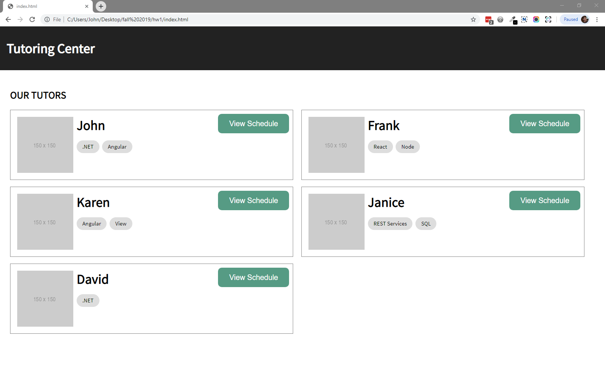
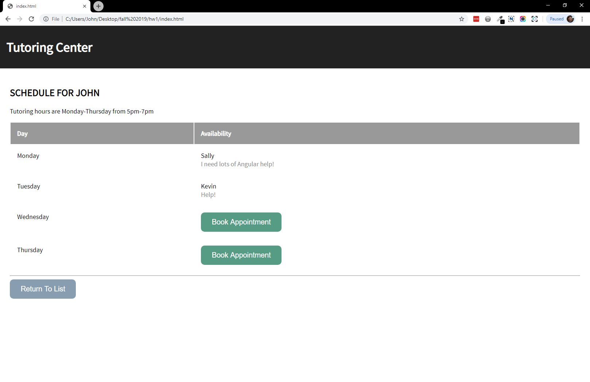
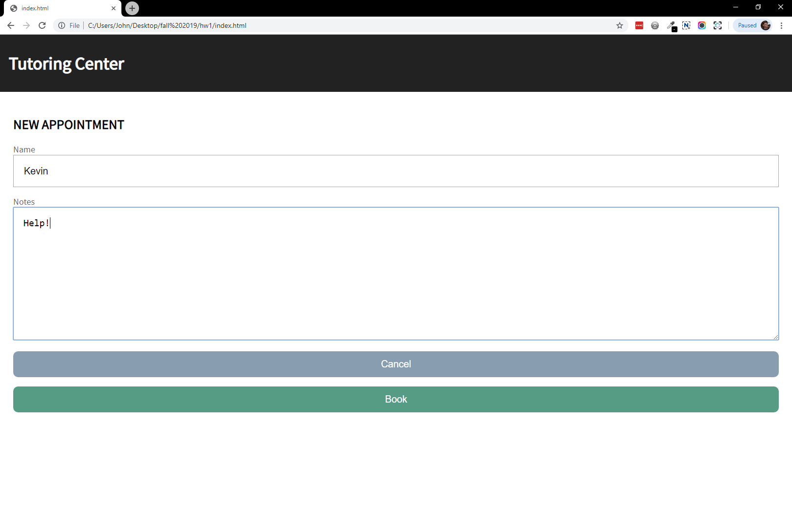

# Assignment 2

For this assignment, you will be creating a scheduling system for a tutoring center using JavaScript, HTML and CSS.

Watch this [video](https://johnlawrimore.com/smu/hw2/hw2_video.webm) to see what is expected in your finished product.

Then, download this [starting point](https://johnlawrimore.com/smu/hw2/HW2%20-%20Starting%20Point.zip) which includes all the files you need. Each file includes instructions for implementation. The download also includes the video above and 3 screenshots.

Follow the instructions inside the files to make your application functional, then add styling to replicate what you see in the screenshots. **Do not use any libraries for this assignment.**

