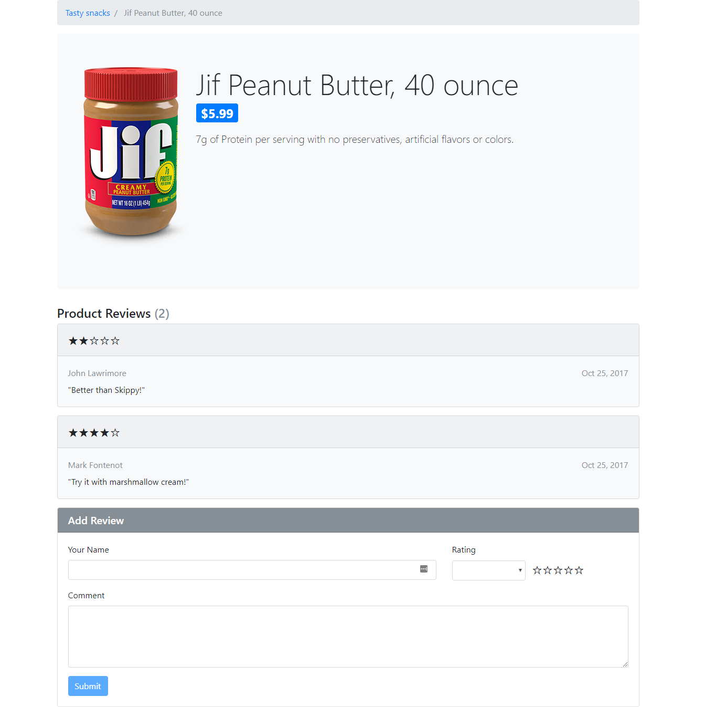
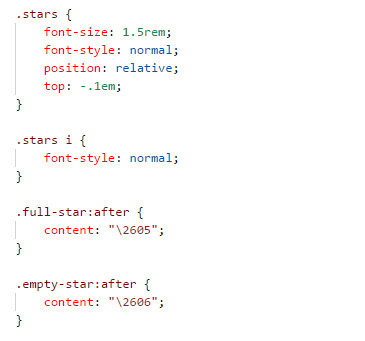
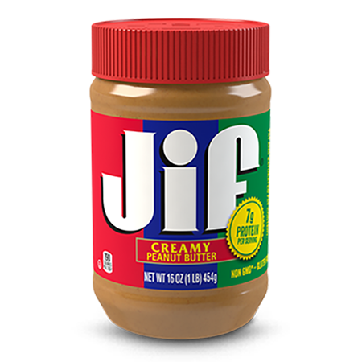

# Assignment 3

For this assignment, you will be creating a product review page with React that dynamically displays product information loaded from an API, a list of reviews, and a form to add a new review (as shown above).

Watch this [video](https://johnlawrimore.com/smu/hw3/hw3_video.webm) for demonstration.

**As always, I recommend reading all assignment instructions before getting started.** Make sure to follow the instructions carefully. Points will be deducted for variations from what is outlined below.

For implementation, you will want to rely heavily on the examples, along with the associated lectures. Unless otherwise stated here, everything you need for this assignment can be found there.

# Getting Started

## Setup

You will want to begin by starting a new project using
the** create-react-app **tool called \"store\".

Don\'t forget to remove unneeded content from the boilerplate.

-   Clear App component HTML

-   Delete app.css and its import statement

-   Get rid of logo.svg and its import statement

## Styling

For styling on this assignment, you will need to install Material UI (MUI) and/or Bootstrap.

MUI: **npm install bootstrap @popperjs/core --save**
Bootstrap: **npm install @mui/material @emotion/react @emotion/styled --save**

Inside your index.js, you will need to add these imports to use Bootstrap...

**import \'bootstrap\';**
**import \'bootstrap/dist/css/bootstrap.min.css\';**

If you use any MUI components, you will import them in the same file in which they are used.

Reference [MUI's website](https://mui.com/material-ui/getting-started/) or [Bootstrap's website](https://getbootstrap.com/) for duplicating the styles shown in screenshot and video. 

You should need little to no CSS for this assignment beyond Bootstrap (other than the CSS provided for you below).

## API Interaction

For API interaction, you will need to install Axios.

**npm install axios --save**

# Acceptance Criteria

-   Given a product...

    -   product details (name, image, description and price) are loaded
        > from the API and displayed with list of reviews and a form to
        > add a review.

    -   when no reviews exist...

        -   the \"Be the first to review\" message is shown.

        -   review count shows 0.

    -   when one or more reviews exist...

        -   each review is shown in the list with rating, user name,
            > date and comment,

        -   correct review count is shown,

        -   \"Be the first to review\" message is hidden.

    -   when user selects a rating from the rating drop-down...

        -   the selected rating is shown in stars next to the filed.

    -   when user enters review and clicks submit...

        -   the new review is shown in the list.

        -   the form is cleared.

# Implementation

## File Structure

Do not deviate from the following file structure. Remember to use the
.**jsx** file extension for all components and leverage barrel files for
module loading.

## Models

For this assignment, you will be working with two models. While we will
not be instantiating either as part of this assignment, its always a
good idea to define your Data Transfer Objects (DTOs).

### Product

-   id

-   name

-   description

-   price

-   imageUrl

-   reviews

### ProductReview

-   userName

-   rating

-   comment

-   date

## API

### productsApi

productsApi.js will contain functions that perform CRUD operations
against an API. For this, you will need to import Axios into this file.

Define the following constants. They should not be exported.

|-------------------|--------------------------------------------------|
| **Constant Name** | **Value**                                        |
|-------------------|--------------------------------------------------|
| baseEndpoint  | [https://api.johnlawrimore.com/store/products](https://api.johnlawrimore.com/store/products) |
|---------------|------------------------------------------------------|
| headers       | {\                                                   |
|               |      \"Authorization\" : \"xxx\"\                    |
|               | }                                                    |
|               |                                                      |
|               | **IMPORTANT:  **Replace xxx with your first initial  |
|               | and last name as it is listed in canvas. If your     |
|               | name does not match, you will not receive data back  |
|               | from the API!                                        |
|---------------|------------------------------------------------------|

Build out the following function:

  -----------------------------------------------------------------------------------------------------
  **Function       **Passed         **Return Value**     **Description**   **API Endpoint**
  Name**           Arguments**                                             
  ---------------- ---------------- -------------------- ----------------- ----------------------------
  getProductById   productId        Promise\<Product\>   Gets product from store/products/{productId}
                                                         API by ID         

  -----------------------------------------------------------------------------------------------------

We will be adding more functions here in the next assignment.

## Components

For HW3, your store will have the following components in addition to
the App component.** **All components must be function components and
must be in their own file.

### productDetails

+----------+-----------------------------------------------------------+
| *        | Displays product details of a product loaded from the API |
| *Usage** |                                                           |
+==========+===========================================================+
| **Loc    | app                                                       |
| ation(s) |                                                           |
| Used**   |                                                           |
+----------+-----------------------------------------------------------+
| *        | None                                                      |
| *Props** |                                                           |
+----------+-----------------------------------------------------------+
| *        | -   product / setProduct                                  |
| *State** |                                                           |
+----------+-----------------------------------------------------------+
| **E      | -   On component\'s initial rendering, call               |
| ffects** |     > getProductById (located in productsApi.js) and pass |
|          |     > it a hard-coded ID of 1. We will make this value    |
|          |     > dynamic in the next assignment. When the promise is |
|          |     > fulfilled, call setProduct with value returned.     |
+----------+-----------------------------------------------------------+
| **Co     | -   Navigation bar with static breadcrumb (this does not  |
| ntents** |     > need to work)                                       |
|          |                                                           |
|          | -   Bound elements to display the product details         |
|          |     > (presented in jumbotron)                            |
|          |                                                           |
|          |     -   Product image (shown to left of text)             |
|          |                                                           |
|          |     -   Name                                              |
|          |                                                           |
|          |     -   Price (show in badge)                             |
|          |                                                           |
|          |     -   Description                                       |
|          |                                                           |
|          | -   reviewList component                                  |
|          |                                                           |
|          | -   reviewForm component                                  |
+----------+-----------------------------------------------------------+
| *        | -   You will need to bind the src attribute of the image  |
| *Notes** |     > to product.imageUrl                                 |
|          |                                                           |
|          | -   You will need a method to handle when a new review is |
|          |     > added by reviewForm. This method will clone         |
|          |     > product, add the productReview that was passed in   |
|          |     > to product.reviews, and call product\'s setter with |
|          |     > the clone.                                          |
|          |                                                           |
|          | -   When you reload your page, any reviews you added will |
|          |     > disappear. This is expected since we are not saving |
|          |     > them back to the API. This will be addressed in the |
|          |     > next assignment.                                    |
+----------+-----------------------------------------------------------+

### reviewList

+----------+-----------------------------------------------------------+
| *        | Displays a list of user reviews                           |
| *Usage** |                                                           |
+==========+===========================================================+
| **Loc    | productDetails                                            |
| ation(s) |                                                           |
| Used**   |                                                           |
+----------+-----------------------------------------------------------+
| *        | -   reviews                                               |
| *Props** |                                                           |
+----------+-----------------------------------------------------------+
| *        | None                                                      |
| *State** |                                                           |
+----------+-----------------------------------------------------------+
| **E      | None                                                      |
| ffects** |                                                           |
+----------+-----------------------------------------------------------+
| **Co     | -   \"Product Reviews\" header with review count in       |
| ntents** |     > parenthesis                                         |
|          |                                                           |
|          | -   \"Be the first to add a review!\" message shown ONLY  |
|          |     > when there are no reviews                           |
|          |                                                           |
|          | -   Card for EACH review in reviews                       |
|          |                                                           |
|          |     -   Header with rating component                      |
|          |                                                           |
|          |     -   User name                                         |
|          |                                                           |
|          |     -   Date (displayed to far right of User name)        |
|          |                                                           |
|          |     -   Comment                                           |
+----------+-----------------------------------------------------------+
| *        | -   Don\'t forget the key attribute on your repeating     |
| *Notes** |     > element. Since we have not assigned an id to        |
|          |     > productReview (this will happen in the next         |
|          |     > assignment), you will need to use index as your     |
|          |     > key. We did an example of this in class.            |
|          |                                                           |
|          | -   Don\'t forget your logic to display the \"Be the      |
|          |     > first to Review\" message when no reviews exist on  |
|          |     > the product (product.reviews.length === 0). To      |
|          |     > dynamically show or hide an element, use the {      |
|          |     > someCondition && \<Element /\> } convention.        |
+----------+-----------------------------------------------------------+

### reviewForm

+----------+-----------------------------------------------------------+
| *        | Form for leaving a new user review                        |
| *Usage** |                                                           |
+==========+===========================================================+
| **Loc    | productDetails                                            |
| ation(s) |                                                           |
| Used**   |                                                           |
+----------+-----------------------------------------------------------+
| *        | -   onReviewAdded                                         |
| *Props** |                                                           |
+----------+-----------------------------------------------------------+
| *        | -   userName / setUserName                                |
| *State** |                                                           |
|          | -   rating / setRating                                    |
|          |                                                           |
|          | -   comment / setComment                                  |
|          |                                                           |
|          | -   ratingOptions (no setter is needed if you provide the |
|          |     > initial value to useState())                        |
+----------+-----------------------------------------------------------+
| **E      | None                                                      |
| ffects** |                                                           |
+----------+-----------------------------------------------------------+
| **Co     | -   \"Add Review\" header                                 |
| ntents** |                                                           |
|          | -   Form fields for leaving review                        |
|          |                                                           |
|          |     -   Your name (textField component)                   |
|          |                                                           |
|          |     -   Rating (select component with rating component    |
|          |         > next to it bound)                               |
|          |                                                           |
|          |     -   Comment (textArea component)                      |
|          |                                                           |
|          | -   Submit button                                         |
+----------+-----------------------------------------------------------+
| *        | -   Don\'t forget your button\'s type attribute!          |
| *Notes** |                                                           |
|          | -   When submit is clicked, invoke onReviewAdded with {   |
|          |     > userName, rating, comment, date: new                |
|          |     > Date().toDateString() } and clear the form          |
|          |                                                           |
|          | -   ratingOptions is needed to bind the options prop on   |
|          |     > your SelectField. It can be initialized with the    |
|          |     > following array.\                                   |
|          |     > \[\                                                 |
|          |     >      { value: 1, label: \'1 stars\' },\             |
|          |     >      { value: 2, label: \'2 stars\' },\             |
|          |     >      { value: 3, label: \'3 stars\' },\             |
|          |     >      { value: 4, label: \'4 stars\' },\             |
|          |     >      { value: 5, label: \'5 stars\' }\              |
|          |     > \]                                                  |
+----------+-----------------------------------------------------------+

### rating

+----------+-----------------------------------------------------------+
| *        | Depicts a rating value in the form of stars (1-5)         |
| *Usage** |                                                           |
+==========+===========================================================+
| **Loc    | -   reviewList (show in header of each review)            |
| ation(s) |                                                           |
| Used**   | -   reviewForm (shown next to the select)                 |
+----------+-----------------------------------------------------------+
| *        | -   value                                                 |
| *Props** |                                                           |
+----------+-----------------------------------------------------------+
| *        | None                                                      |
| *State** |                                                           |
+----------+-----------------------------------------------------------+
| **E      | None                                                      |
| ffects** |                                                           |
+----------+-----------------------------------------------------------+
| **Co     |                           |
|          |                                                           |
|          | *(the plus sign ensures that value is evaluated as a      |
|          | number)*                                                  |
+----------+-----------------------------------------------------------+
| **CSS**  |                            |
+----------+-----------------------------------------------------------+
| *        | -   Note that Rating has a jsx and css. Don\'t forget to  |
| *Notes** |     > import your CSS at the top of your jsx file         |
+----------+-----------------------------------------------------------+

### textField

+----------+-----------------------------------------------------------+
| *        | Depicts a text input with label                           |
| *Usage** |                                                           |
+==========+===========================================================+
| **Loc    | -   reviewForm                                            |
| ation(s) |                                                           |
| Used**   |                                                           |
+----------+-----------------------------------------------------------+
| *        | -   label                                                 |
| *Props** |                                                           |
|          | -   value                                                 |
|          |                                                           |
|          | -   setValue                                              |
+----------+-----------------------------------------------------------+
| *        | None                                                      |
| *State** |                                                           |
+----------+-----------------------------------------------------------+
| **E      | None                                                      |
| ffects** |                                                           |
+----------+-----------------------------------------------------------+
| *        | This can be borrowed from the class exercise              |
| *Notes** |                                                           |
+----------+-----------------------------------------------------------+

### selectField

+----------+-----------------------------------------------------------+
| *        | Depicts a select with label                               |
| *Usage** |                                                           |
+==========+===========================================================+
| **Loc    | -   reviewForm                                            |
| ation(s) |                                                           |
| Used**   |                                                           |
+----------+-----------------------------------------------------------+
| *        | -   label                                                 |
| *Props** |                                                           |
|          | -   value                                                 |
|          |                                                           |
|          | -   setValue                                              |
|          |                                                           |
|          | -   options                                               |
|          |                                                           |
|          | -   optionValueKey                                        |
|          |                                                           |
|          | -   optionLabelKey                                        |
+----------+-----------------------------------------------------------+
| *        | None                                                      |
| *State** |                                                           |
+----------+-----------------------------------------------------------+
| **E      | None                                                      |
| ffects** |                                                           |
+----------+-----------------------------------------------------------+
| *        | This can be borrowed from the class exercise              |
| *Notes** |                                                           |
+----------+-----------------------------------------------------------+

### textAreaField

+----------+-----------------------------------------------------------+
| *        | Depicts a text area with label                            |
| *Usage** |                                                           |
+==========+===========================================================+
| **Loc    | -   reviewForm                                            |
| ation(s) |                                                           |
| Used**   |                                                           |
+----------+-----------------------------------------------------------+
| *        | -   label                                                 |
| *Props** |                                                           |
|          | -   value                                                 |
|          |                                                           |
|          | -   setValue                                              |
+----------+-----------------------------------------------------------+
| *        | None                                                      |
| *State** |                                                           |
+----------+-----------------------------------------------------------+
| **E      | None                                                      |
| ffects** |                                                           |
+----------+-----------------------------------------------------------+
| *        | Use textField and selectField as your example             |
| *Notes** |                                                           |
+----------+-----------------------------------------------------------+

General Hints

-   Don\'t forget HTML variances like *className* and *htmlFor*

-   Keep your Chrome Dev Tools open!

-   Leverage the React Developer Tools (Component Tab)

