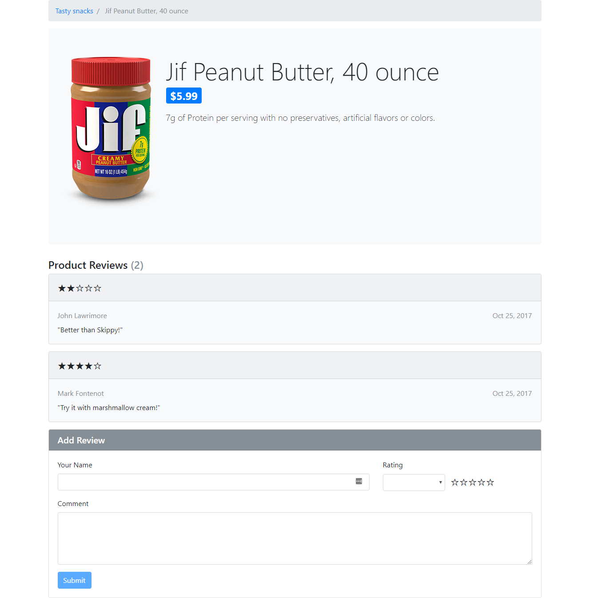
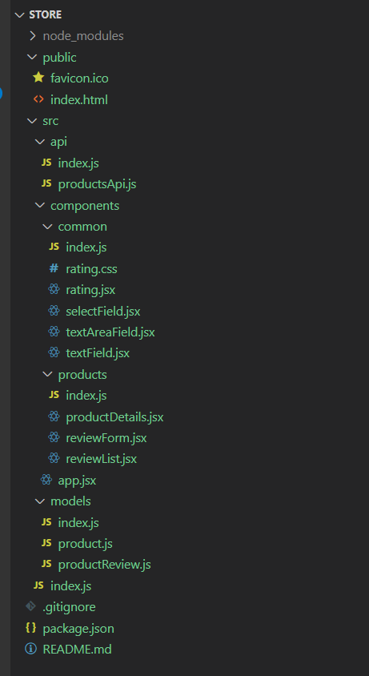
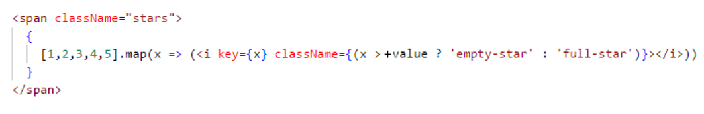
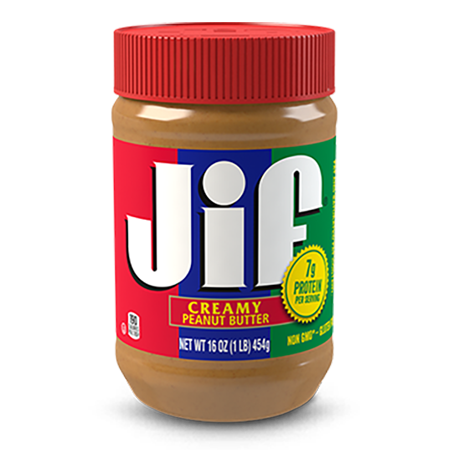

# Assignment 3

For this assignment, you will be creating a product review page with React that dynamically displays product information loaded from an API, a list of reviews, and a form to add a new review (as shown above).

Watch this [video](https://johnlawrimore.com/smu/hw3/hw3_video.webm) for demonstration.

**As always, I recommend reading all assignment instructions before getting started.** Make sure to follow the instructions carefully. Points will be deducted for variations from what is outlined below.

For implementation, you will want to rely heavily on the examples, along with the associated lectures. Unless otherwise stated here, everything you need for this assignment can be found there.



# Getting Started

## Setup

You will want to begin by starting a new project using
the** create-react-app **tool called \"store\".

Don\'t forget to remove unneeded content from the boilerplate.

<ul>
	<li>Clear App component HTML</li>
	<li>Delete app.css and its import statement</li>
	<li>Get rid of logo.svg and its import statement</li>
</ul>

## Styling

For styling on this assignment, you will need to install Material UI (MUI) and/or Bootstrap.

MUI: 

```bash
npm install bootstrap @popperjs/core --save
```

Bootstrap: 

```bash
npm install @mui/material @emotion/react @emotion/styled --save
```

Inside your index.js, you will need to add these imports to use Bootstrap...

```js
import 'bootstrap';
import 'bootstrap/dist/css/bootstrap.min.css';
```

If you use any MUI components, you will import them in the same file in which they are used. **You may not use any MUI components that replace the components listed in this document.**

Reference [MUI's website](https://mui.com/material-ui/getting-started/) or [Bootstrap's website](https://getbootstrap.com/) for duplicating the styles shown in screenshot and video. 

You should need little to no CSS for this assignment beyond Bootstrap (other than the CSS provided for you below).

## API Interaction

For API interaction, you will need to install Axios.

```bash
npm install axios --save
```

# Acceptance Criteria

<ul>
	<li>Given initial visit to the site
		<ul>
			<li>user is shown a list of products</li>
		</ul>
	</li>
	<li>Given the list of products
		<ul>
			<li>when "Product Details" is clicked
				<ul>
					<li>user is redirected to the product details</li>
				</ul>
			</li>
			<li>when "Add to Cart" is clicked"
				<ul>
					<li>the product is added to the cart</li>
					<li>user is redirected to their cart</li>
				</ul>
			</li>
		</ul>
	</li>
	<li>Given a product detail
		<ul>
			<li>the correct product is loaded based on the id in the URL&nbsp;</li>
			<li>when a review is added
				<ul>
					<li>the review is permanently saved</li>
				</ul>
			</li>
			<li>when "Add to Cart" is clicked
				<ul>
					<li>the product is added to the cart</li>
					<li>user is redirected to their cart&nbsp;</li>
				</ul>
			</li>
		</ul>
	</li>
	<li>Given the user's cart<br />
		<ul>
			<li>each item in cart is displayed with quantity, product name, product price, and a line total</li>
			<li>the total of all items in cart is displayed below item table</li>
		</ul>
	</li>
	<li>Given any view of the store
		<ul>
			<li>when the site logo (name in header) is clicked
				<ul>
					<li>user is redirected back to the product list</li>
				</ul>
			</li>
		</ul>
	</li>
</ul>

# Implementation

## File Structure

Do not deviate from the following file structure. Remember to use the .**jsx** file extension for all components and leverage barrel files for module loading.



## Models

For this assignment, you will be working with two models. While we will
not be instantiating either as part of this assignment, its always a
good idea to define your Data Transfer Objects (DTOs).

### Product

<ul>
	<li>id</li>
	<li>name</li>
	<li>description</li>
	<li>price</li>
	<li>imageUrl</li>
	<li>reviews</li>
</ul>

### ProductReview

<ul>
	<li>userName</li>
	<li>rating</li>
	<li>comment</li>
	<li>date</li>
</ul>

## API

### productsApi

productsApi.js will contain functions that perform CRUD operations against an API. For this, you will need to import Axios into this file.

Define the following constants. They should not be exported.

| **Constant Name** | **Value** |
|---|---|
| baseEndpoint  | https://api.johnlawrimore.com/store/products |
| headers | {<br>&emsp;"Authorization" : "rdschaefer"<br>} |


Build out the following function:

| **Function Name** | **Passed Arguments** | **Return Value** | **Description** | **API Endpoint** |
|---|---|---|---|---|
| getProductById | productId | Promise<Product\> | Gets product from API by ID | store/products/{productId} |

We will be adding more functions here in the next assignment.

## Components

For this assignment, your store will have the following components in addition to the App component. **All components must be function components and must be in their own file.**

### productDetails

| | |
|---|---|
| **Usage** | Displays product details of a product loaded from the API |
| **Location(s) Used** | app |
| **Props** | None |
| **State** | <ul><li>product / setProduct</li></ul> |
| **Effects** | <ul><li>On component's initial rendering, call getProductById (located in productsApi.js) and pass it a hard-coded ID of 1. We will make this value dynamic in the next assignment. When the promise is fulfilled, call setProduct with value returned.</li></ul> |
| **Contents** | <ul><li>Navigation bar with static breadcrumb (this does not need to work)</li><li>Bound elements to display the product details (presented in jumbotron)<ul><li>Product image (shown to left of text)</li><li>Name</li><li>Price (show in badge)</li><li>Description</li></ul></li><li>reviewList component</li><li>reviewForm component</li></ul> |
| **Notes** | <ul><li>You will need to bind the src attribute of the image to product.imageUrl</li><li>You will need a method to handle when a new review is added by reviewForm. This method will clone product,&nbsp;add the productReview that was passed in to product.reviews, and&nbsp;call product's setter with the clone.</li><li>When you reload your page, any reviews you added will disappear. This is expected since we are not saving them back to the API. This will be addressed in the next assignment.</li></ul> |

### reviewList

| | |
|---|---|
| **Usage** | Displays product details of a product loaded from the API |
| **Location(s) Used** | app |
| **Props** | <ul><li>reviews</li></ul> |
| **State** | None |
| **Effects** | None |
| **Contents** | <ul><li>"Product Reviews" header with review count in parenthesis</li><li>"Be the first to add a review!" message shown ONLY when there are no reviews</li><li>Card for EACH review in reviews<ul><li>Header with rating component</li><li>User name</li><li>Date (displayed to far right of User name)</li><li>Comment</li></ul></li></ul> |
| **Notes** | <ul><li>Don't forget the key attribute on your repeating element. Since we have not assigned an id to productReview (this will happen in the next assignment), you will need to use index as your key. We did an example of this in class.</li><li>Don't forget your logic to display the "Be the first to Review" message when no reviews exist on the product (product.reviews.length === 0). To dynamically show or hide an element, use the { someCondition &amp;&amp; &lt;Element /&gt; } convention.</li></ul> |

### reviewForm

| | |
|---|---|
| **Usage** | Form for leaving a new user review |
| **Location(s) Used** | productDetails |
| **Props** | <ul><li>productDetails</li></ul> |
| **State** | <ul><li>userName / setUserName</li><li>rating / setRating</li><li>comment / setComment</li><li>ratingOptions (no setter is needed if you provide the initial value to useState())</li></ul> |
| **Effects** | None |
| **Contents** | <ul><li>"Add Review" header</li><li>Form fields for leaving review<ul><li>Your name (textField component)</li><li>Rating (select component with rating component next to it bound)</li><li>Comment (textArea component)</li></ul></li><li>Submit button</li></ul> |
| **Notes** | <ul><li>Don't forget your button's type attribute!</li><li>When submit is clicked, invoke onReviewAdded with { userName, rating, comment, date: new Date().toDateString() } and clear the form</li><li>ratingOptions is needed to bind the options prop on your SelectField. It can be initialized with the following array.<br />[<br />&nbsp; &nbsp; &nbsp;{ value: 1, label: '1 stars' },<br />&nbsp; &nbsp; &nbsp;{ value: 2, label: '2 stars' },<br />&nbsp; &nbsp; &nbsp;{ value: 3, label: '3 stars' },<br />&nbsp; &nbsp; &nbsp;{ value: 4, label: '4 stars' },<br />&nbsp; &nbsp; &nbsp;{ value: 5, label: '5 stars' }<br />]&nbsp;</li></ul> |

### rating

| | |
|---|---|
| **Usage** | Depicts a rating value in the form of stars (1-5) |
| **Location(s) Used** | <ul><li>reviewList (show in header of each review)</li><li>reviewForm (shown next to the select)</li></ul> |
| **Props** | <ul><li>value</li></ul> |
| **State** | None |
| **Effects** | None |
| **Contents** |  <br> *(the plus sign ensures that value is evaluated as a number)* |
| **CSS** |  |
| **Notes** | Note that Rating has a jsx and css. Don't forget to import your CSS at the top of your jsx file |

### textField

| | |
|---|---|
| **Usage** | Depicts a text input with label |
| **Location(s) Used** | <ul><li>reviewForm</li></ul> |
| **Props** | <ul><li>label</li><li>value</li><li>setValue</li></ul> |
| **State** | None |
| **Effects** | None |
| **Notes** | This can be borrowed from the code example |

### selectField

| | |
|---|---|
| **Usage** | Depicts a select with label |
| **Location(s) Used** | <ul><li>reviewForm</li></ul> |
| **Props** | <ul><li>label</li><li>value</li><li>setValue</li><li>options</li><li>optionValueKey</li><li>optionLabelKey</li></ul> |
| **State** | None |
| **Effects** | None |
| **Notes** | This can be borrowed from the code example |

### textAreaField

| | |
|---|---|
| **Usage** | Depicts a text area with label |
| **Location(s) Used** | <ul><li>reviewForm</li></ul> |
| **Props** | <ul><li>label</li><li>value</li><li>setValue</li></ul> |
| **State** | None |
| **Effects** | None |
| **Notes** | This can be borrowed from the code example |

General Hints

<ul>
	<li>Don't forget HTML variances like&nbsp;<em>className</em>&nbsp;and&nbsp;<em>htmlFor</em></li>
	<li>Keep your Chrome Dev Tools open!</li>
	<li>Leverage the React Developer Tools (Component Tab)</li>
</ul>


