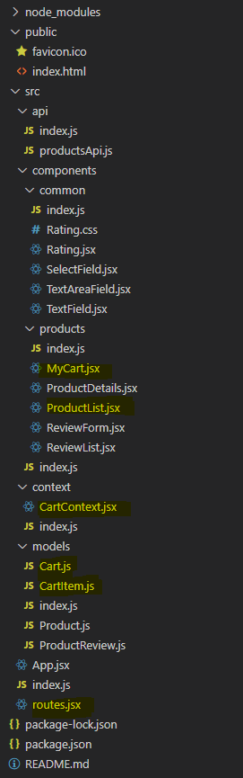
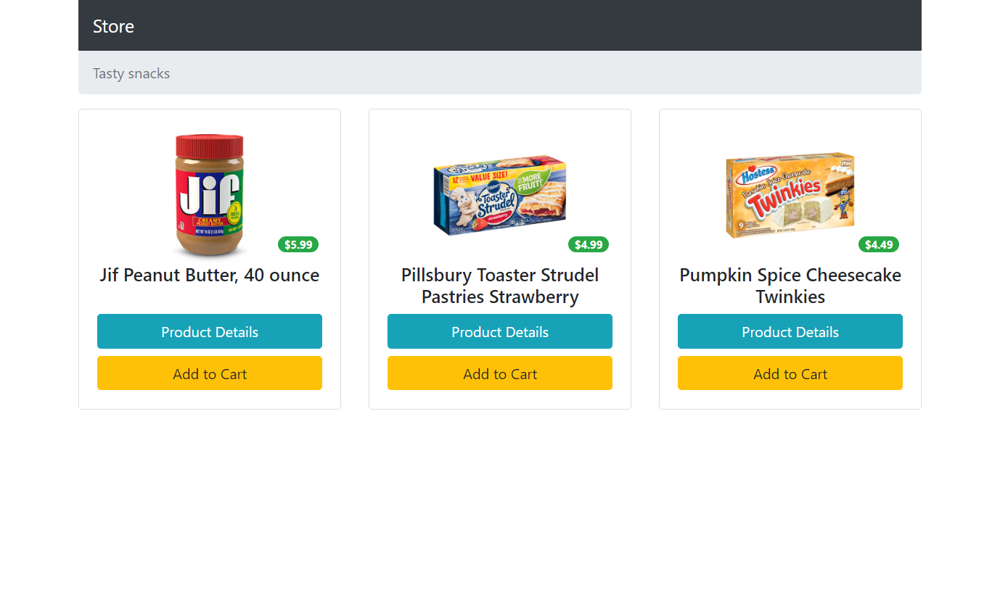
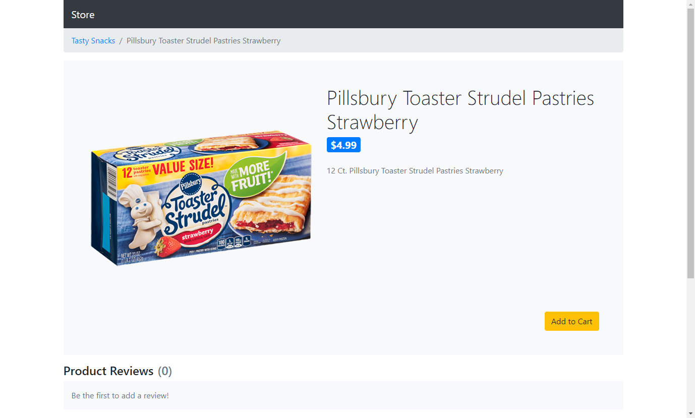
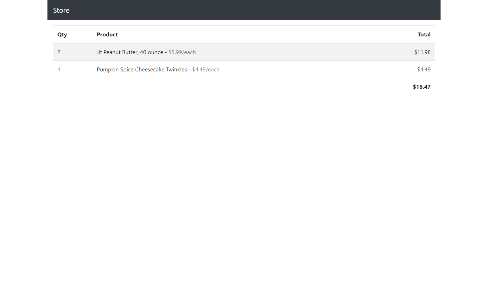

# Assignment 4

For this assignment, you will be adding new functionality to Assignment 3.

<ul>
	<li>Routing</li>
	<li>A product list and cart viewer</li>
	<li>Shared context for handling the user's cart</li>
	<li>Two additional API interactions (load products and save review)</li>
</ul>

**READ EVERYTHING BEFORE YOU START**

Watch this [video](https://drive.google.com/file/d/1kgcMOHwjB6rt-CRmMwxusoH3TaAJeM4U/view?usp=sharing) for demonstration...

# Requirements

## Acceptance Criteria

<ul>
	<li>Given initial visit to the site
		<ul>
			<li>user is shown a list of products</li>
		</ul>
	</li>
	<li>Given the list of products
		<ul>
			<li>when "Product Details" is clicked
				<ul>
					<li>user is redirected to the product details</li>
				</ul>
			</li>
			<li>when "Add to Cart" is clicked"
				<ul>
					<li>the product is added to the cart</li>
					<li>user is redirected to their cart</li>
				</ul>
			</li>
		</ul>
	</li>
	<li>Given a product detail
		<ul>
			<li>the correct product is loaded based on the id in the URL&nbsp;</li>
			<li>when a review is added
				<ul>
					<li>the review is permanently saved</li>
				</ul>
			</li>
			<li>when "Add to Cart" is clicked
				<ul>
					<li>the product is added to the cart</li>
					<li>user is redirected to their cart&nbsp;</li>
				</ul>
			</li>
		</ul>
	</li>
	<li>Given the user's cart<br />
		<ul>
			<li>each item in cart is displayed with quantity, product name, product price, and a line total</li>
			<li>the total of all items in cart is displayed below item table</li>
		</ul>
	</li>
	<li>Given any view of the store
		<ul>
			<li>when the site logo (name in header) is clicked
				<ul>
					<li>user is redirected back to the product list</li>
				</ul>
			</li>
		</ul>
	</li>
</ul>

## File Structure

The highlighted files are being added with this assignment. **Please do not deviate from this file structure.**



# Implementation

## Models

Two new models are added with this assignment.

### Cart

<ul>
	<li>items</li>
	<li>total</li>
</ul>

### CartItem

<ul>
	<li>product</li>
	<li>quantity</li>
	<li>totalPrice</li>
</ul>

## API

### productsApi

Add the following methods to productsApi.

| Function Name | Passed Arguments | Return Value | Description | API Endpoint |
|---|---|---|---|---|
| getProducts | N/A | Promise<Product[]> | Gets an a rray of products from the API | products/ |
| addReview | productId, review | Promise<Review> | Posts a review for an existing product to the API | products/{productId}/reviews |

## Routes

Your project will need a route array configuration with the following
routes:

| Path | Element |
|---|---|
| / | ProductList |
| /products/[productId]\* | ProductDetails |
| /cart | MyCart |

*\* not actual syntax for route parameter*

## Context

### CartContext

CartContext will handle the user's cart and be shared across the application.

Use createContext hook to instantiate the context with an initial value of undefined.

### CartContextProvider

Create a component to encapsulate the CartContext.Provider and manage the cart state.

This component can be placed in the same file as CartContext.

| | |
|---|---|
| **Usage** | Encapsulates the CartContext.Provider and manages state of the cart |
| **Location(s) Used** | App |
| **Props** | children |
| **Context(s)** | None |
| **State** | <ul><li>cart / setCart<ul><li>Initial value = { items: [], total: 0 }</li></ul></li></ul> |
| **Effects** | None |
| **Logic** | Add the function below this table to handle cart updates. This will be exposed to the provider instead of setCart. |
| **Notes** | <ul><li>Value prop of CartContext.Provider should be given { cart, addToCart }. These will be used in various components</li><li>Bind children from props inside CardContext.Provider</li></ul> |

```js
const addToCart = (product) => {
    let _cart = { ...cart };
    let existing = _cart.items.find(x => x.product.id === product.id);
    if (existing) {
        existing.quantity += 1;
        existing.totalPrice = existing.product.price * existing.quantity;
    } else {
      _cart.items.push({ product, quantity: 1, totalPrice: product.price });
    }

    _cart.total = _cart.items.map(x => x.totalPrice).reduce((x, y) => x + y);
    setCart(_cart);
}
```

Returns:

```jsx
<CartContext.Provider>
    //TODO: Set value prop of CartContext.Provider
    //TODO: Render children here
</CardContext.Provider>
```

## New Components

For this assignment, your store will have the following new components.

### ProductList

| | |
|---|---|
| **Usage** | Displays list of products in store |
| **Location(s) Used** | Router in App |
| **Props** | None |
| **Context(s)** | CartContext |
| **State** | <ul><li>products / setProducts</li></ul> |
| **Effects** | <ul><li>On component's initial rendering, call getProducts in productsApi. When the promise is fulfilled, call setProducts with value returned.</li></ul> |
| **Returns** | <ul><li>Nav bar with static breadcrumb</li><li>Bound list of products presented in cards<ul><li>Product image</li><li>Name</li><li>Price (show in badge)</li><li>"Product Details" button</li><li>"Add to Cart" button</li></ul></li></ul> |
| **Notes** | <ul><li>use the useContext hook to reference the CartContext</li><li>In the Add to Cart onclick event, pass the product to addToCart located on cartContext before redirecting to the cart</li><li>Use the Link component or the useNavigate hook to handle redirecting when the two buttons are clicked.</li></ul> |

### MyCart

| | |
|---|---|
| **Usage** | Displays list of items in user's cart |
| **Location(s) Used** | Router in App |
| **Props** | None |
| **Context(s)** | CartContext |
| **State** | None |
| **Effects** | None |
| **Returns** | <ul><li>Table displaying items in user's cart<ul><li>Quantity</li><li>Name</li><li>Price</li><li>Line Total</li></ul></li><li>Total of all items in cart</li></ul> |
| **Notes** | <ul><li>Map over cartContext.cart.items to create table rows<ul><li>Pay attention to the object structure of cart item<br />(i.e.: item.product.price, item.totalPrice, etc.)</li></ul></li><li>Bind the cart total to cartContext.total</li></ul> |

## Component Modifications

### App

- Update the return value to the following and address TODO notes.

```jsx
<CartContextProvider>
    <BrowserRouter>
        // TODO: Style header and make link navigate to Product List
        <header>Store</header>
        // TODO: Add Routes component here.
        // Inside of Routes, generate individual Route components by mapping over the route constant in routes.jsx.
        // Hint: Use the spread operator to copy all object properties to the mapped component. (i.e.: <Route {...x}></Route>)
    </BrowserRouter>
</CartContextProvider>
```

### ProductDetails

<ul>
	<li>Replace the hard-coded id passed to getProductById with the parameter located on the route.
		<ul>
			<li>Use the useParams hook to get the value.</li>
		</ul>
	</li>
	<li>Use the useContext hook to add a reference to CartContext.</li>
	<li>Add 'Add to Cart' button and logic
		<ul>
			<li>Call addToCart on cartContext</li>
			<li>Redirect to cart using Link component or useNavigate hook</li>
		</ul>
	</li>
	<li>Update the logic for onReviewAdded to save the new review to the repository.
		<ul>
			<li>Call addReview in productsApi with product.id and the new review</li>
			<li>When promise is fulfilled, append the new review to product...</li>
		</ul>
	</li>
</ul>

```js
const _product = {...product};
_product.reviews.push(x);
setProduct(_product);
```

### Other

Replace all form fields (TextField, SelectField, TextAreaField) with their MUI equivalents.

## Styling

Reference [MUI's website](https://mui.com/material-ui/getting-started/) or [Bootstrap's website](https://getbootstrap.com/) for duplicating the styles shown in screenshots and video. 

# Screen Shots

ProductList:



ProductDetails:



MyCart:



**Good Luck!!!**
